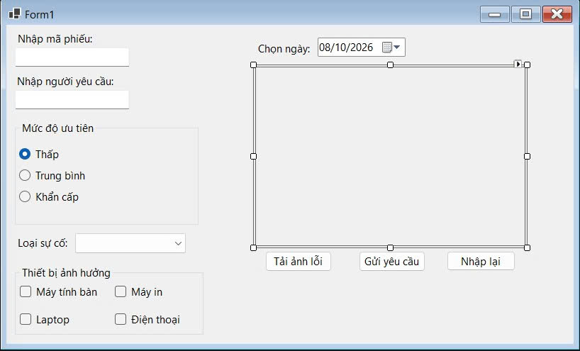
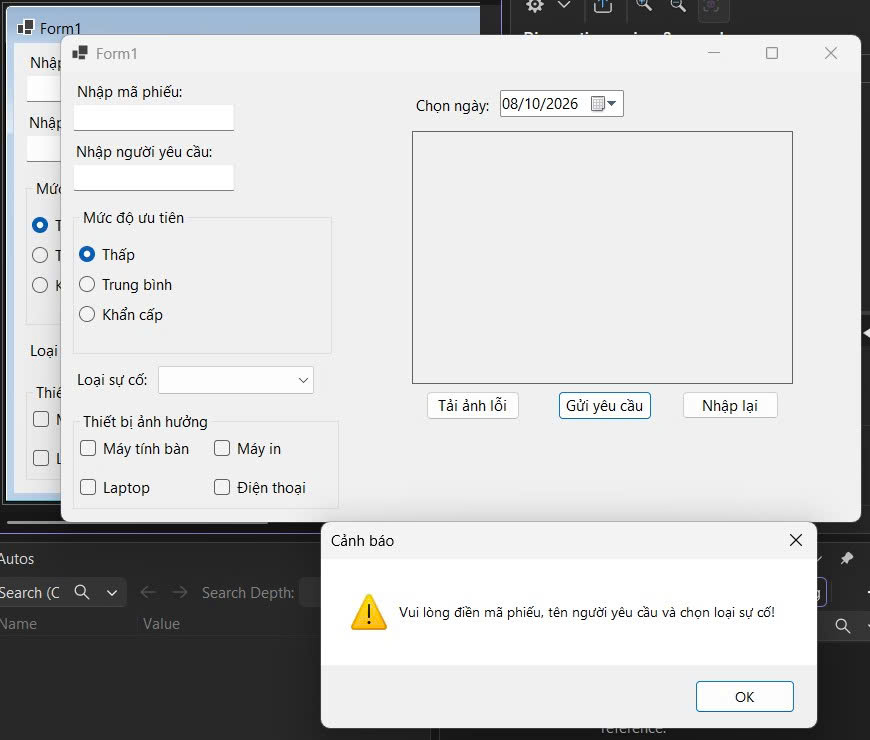

# BÁO CÁO BÀI TẬP / ĐỒ ÁN

## THÔNG TIN SINH VIÊN
- **Họ và tên:** Trần Thị Kim Liên
- **Mã số sinh viên:** 24810320108
- **Lớp:** D19QTANM1
- **Tên môn học:** Lập trình C# / Windows Forms
- **Tên bài tập:** Bài 2 - Form Tiếp nhận & Phân loại sự cố IT

---

## CHỨC NĂNG ĐÃ THỰC HIỆN
- RadioButton (ưu tiên), ComboBox (loại sự cố), CheckBox (thiết bị), DateTimePicker.
- Nút "Tải ảnh lỗi" mở OpenFileDialog (.jpg/.png), hiển thị lên PictureBox với SizeMode = StretchImage.
- "Gửi yêu cầu" gom toàn bộ thông tin và hiển thị bảng tóm tắt qua MessageBox; "Nhập lại" reset form.

---

## KẾT QUẢ THỰC HÀNH

### 1. Ảnh màn hình Giao diện chính
_Giao diện chính (đã tải ảnh lỗi)_

### 2. Ảnh màn hình Chức năng thực thi / Kết quả
_MessageBox tóm tắt sau khi Gửi yêu cầu_

### 3. Ảnh màn hình Kiểm tra lỗi (Validation)
_Cảnh báo khi thiếu thông tin_

